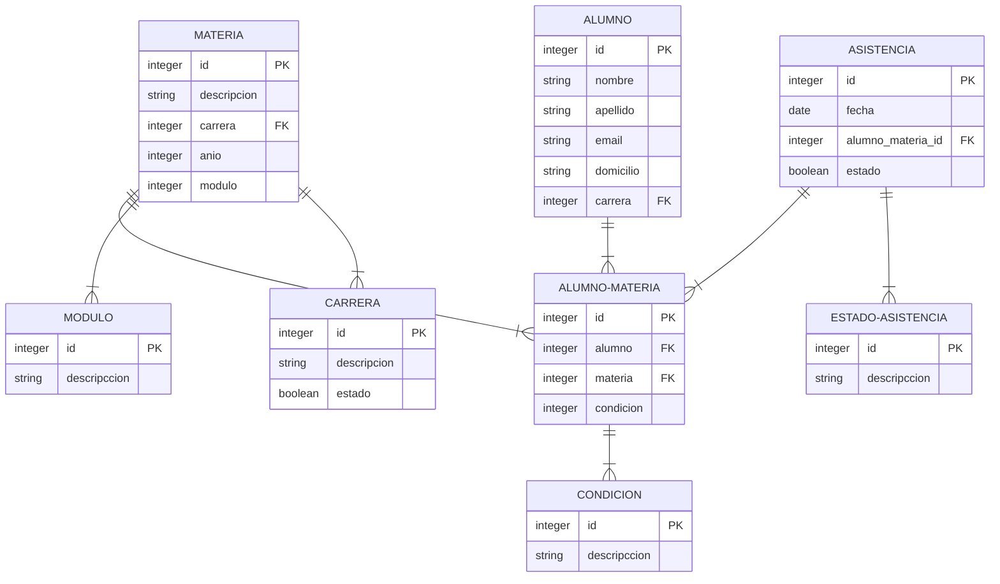
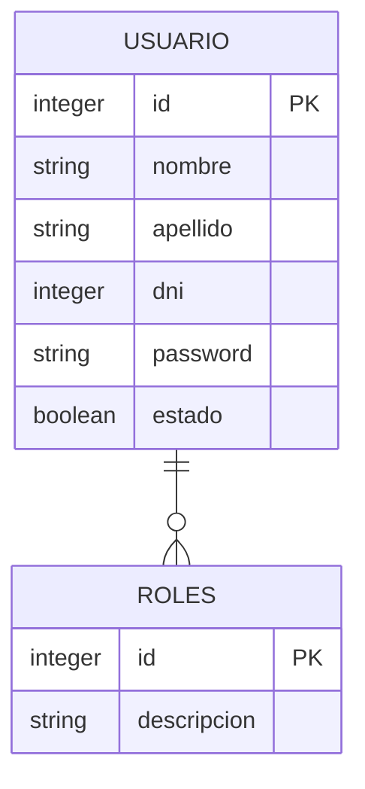
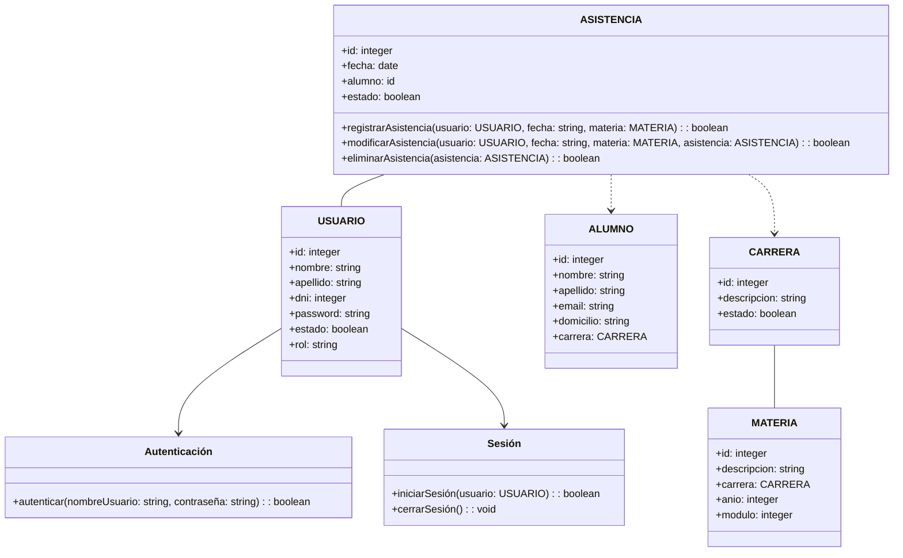
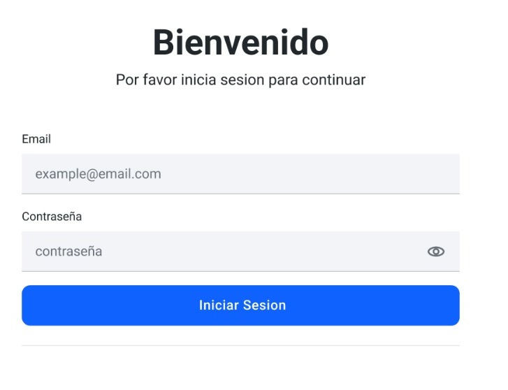
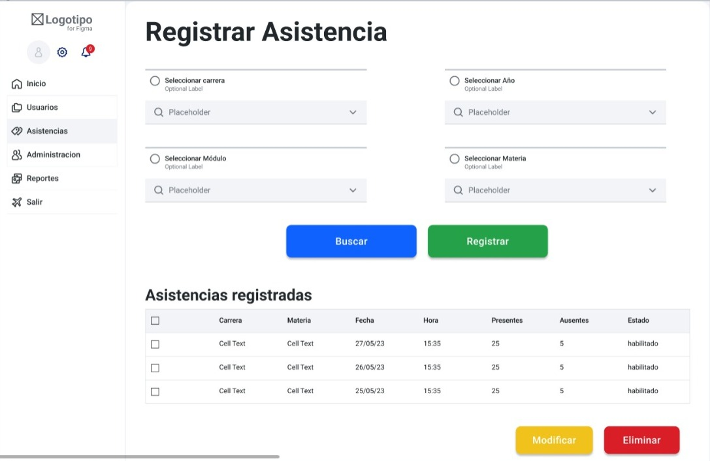
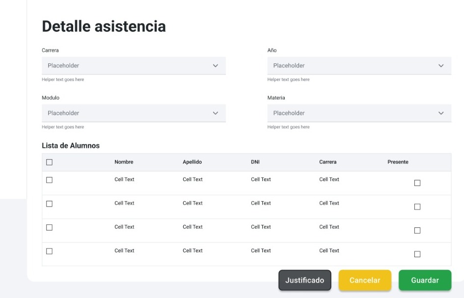

# Trabajo en equipo

**Lider de equipo:** Kevin Jesus Aliendro

**Diseñador:** Juan Ignacio Tiseira

**Analista Funcional:** Sanabria Nicolas Guillermo

# Diseño OO

## Diagrama ER Regsitro de asistencia

 
 
 

### Diagrama ER Login

 

### Diagrama de Clases 

 

# Wireframe y caso de uso

### Wireframe Iniciar Sesión

 
 
 
## Caso de Uso: Iniciar Sesión

**Actor Principal:** Usuario registrado

**Resumen:** El usuario inicia sesión en el sistema ingresando sus credenciales (nombre de usuario y contraseña).

**Precondiciones:** 
- El usuario debe estar registrado en el sistema.
- El usuario debe estar en la página de inicio de sesión.

**Flujo Principal:**

1. El usuario ingresa a la página de inicio de sesión.
2. El sistema muestra un formulario de inicio de sesión con dos campos: "Nombre de Usuario" y "Contraseña".
3. El usuario ingresa su nombre de usuario y contraseña en los campos correspondientes.
4. El usuario hace clic en el botón "Iniciar Sesión".
5. El sistema verifica las credenciales del usuario:
   - Si las credenciales son válidas, el sistema autentica al usuario y le permite acceder a su cuenta.
   - Si las credenciales son inválidas, el sistema muestra un mensaje de error y permite al usuario intentar de nuevo.

**Postcondiciones:**
- Si las credenciales son válidas, el usuario inicia sesión y accede a la pantalla principal.
- Si las credenciales son inválidas, se notifica al usuario.

**Notas:**
- El sistema debe implementar medidas de seguridad adecuadas, como el cifrado de contraseñas, para proteger la información del usuario.

 
 
 
 
 

## Wireframe Gestión de Asistencia por Materia y Período

 
 
 

## Caso de uso Gestión de Asistencia por Materia y Período

**Actor Principal:** Preceptor

**Resumen:** El preceptor registra la asistencia de los alumnos en una clase, filtrando por diferentes criterios y permitiendo marcar ausencias y adjuntar justificaciones.

**Precondiciones:**
- El preceptor debe haber iniciado sesión en el sistema.
- Deben existir registros de alumnos inscritos en la materia.

**Flujo Principal:**

1. El preceptor inicia sesión en el sistema.
2. El preceptor selecciona la materia o asignatura que desea tomar asistencia, utilizando el filtro disponible para "Carrera", "Año", "Módulo", y "Materia".
3. El sistema muestra una lista de alumnos filtrados segun "Carrera", "Año", "Módulo", y "Materia", que se hayan seleccionado.
4. El sistema muestra la lista de alumnos que coinciden con los criterios de filtro seleccionados.

5. El preceptor revisa la lista de alumnos y, para cada estudiante, tiene las siguientes opciones:
   - Marcar "Presente" si el estudiante asistió.
   - Adjuntar un archivo de justificación si el estudiante está ausente seleccionando el alumno.
   - Dejar sin marcar si el estado de asistencia es ausente.

6. El preceptor hace clic en guardar.

**Postcondiciones:**
- Los registros de asistencia se actualizan en el sistema, indicando si un estudiante estuvo presente, ausente o con justificación adjunta.

**Flujos Alternativos:**

1. En el paso 5, el preceptor puede adjuntar archivos de justificación para estudiantes ausentes. El sistema almacena estos archivos en un repositorio adecuado y los relaciona con los registros de asistencia correspondientes.

**Excepciones:**

1. En el paso 3, si no hay alumnos inscritos en la clase que coincidan con los criterios de filtro seleccionados, el sistema muestra un mensaje de notificación.

 
 
 

# Backlog de iteracion

| Historia de Usuario          | Puntaje |      Tiempo estimado en horas |
|-----------------------------|---------|---------------------|
| HU-06: Inicio de Sesion y Seguridad | 3    |   32    |
| HU-03: Gestión de Asistencia por Materia y Período | 5   |   48    |

# Tareas

- Diseño wireframe
- Diagrama ER
- Diagrama de Clases
- Casos de uso