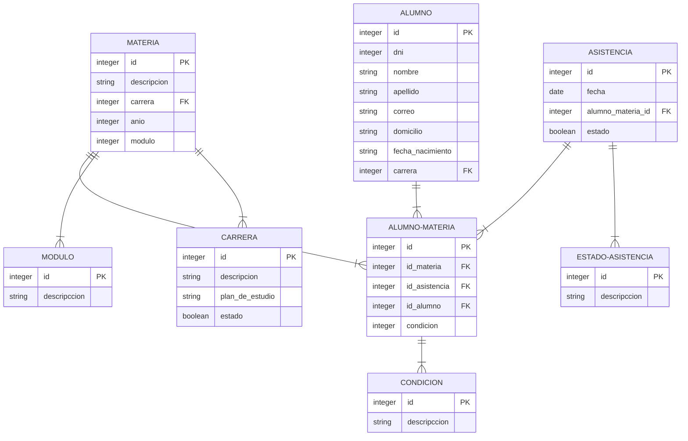
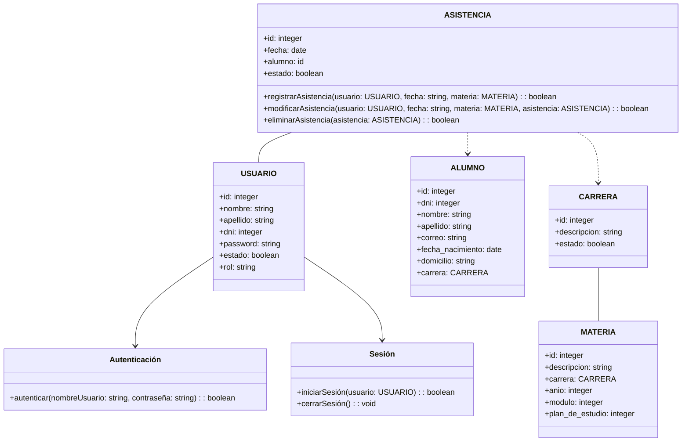
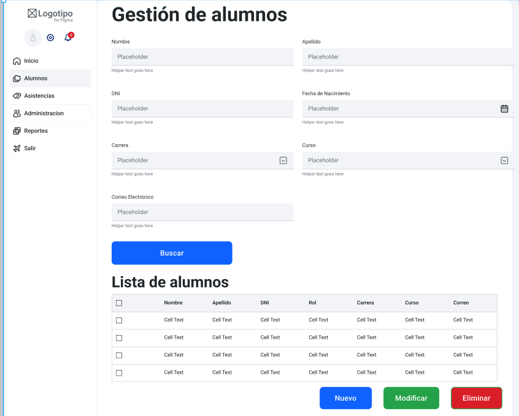
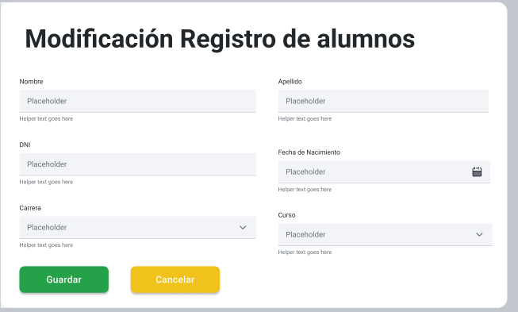
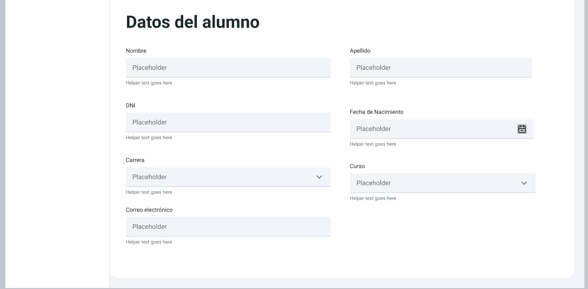
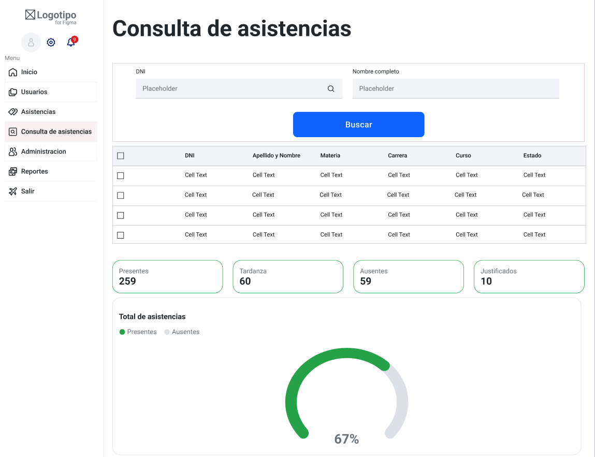

# Trabajo en equipo

**Lider de equipo:** Sanabria Nicolas Guillermo

**Diseñador:** Kevin Jesus Aliendro

**Analista Funcional:** Juan Ignacio Tiseira

# Diseño OO

## Diagrama ER Regsitro de alumno

 
 
 

### Diagrama de Clases 

 

# Wireframe y caso de uso
## Wireframe Gestión de Asistencia por Materia y Período

 
 
 

## Caso de uso Registro de alumnos  

**Actor Principal:** Preceptor

**Resumen:** El preceptor registra la asistencia de los alumnos en una clase, filtrando por diferentes criterios y permitiendo marcar ausencias y adjuntar justificaciones.

**Precondiciones:**
- El preceptor debe haber iniciado sesión en el sistema.
- Deben existir registros de alumnos inscritos en la materia.

**Flujo Principal:**

1. El preceptor inicia sesión en el sistema.
2. El preceptor selecciona la materia o asignatura que desea tomar asistencia, utilizando el filtro disponible para "Carrera", "Año", "Módulo", y "Materia".
3. El sistema muestra una lista de alumnos filtrados segun "Carrera", "Año", "Módulo", y "Materia", que se hayan seleccionado.
4. El sistema muestra la lista de alumnos que coinciden con los criterios de filtro seleccionados.

5. El preceptor revisa la lista de alumnos y, para cada estudiante, tiene las siguientes opciones:
   - Marcar "Presente" si el estudiante asistió.
   - Adjuntar un archivo de justificación si el estudiante está ausente seleccionando el alumno.
   - Dejar sin marcar si el estado de asistencia es ausente.

6. El preceptor hace clic en guardar.

**Postcondiciones:**
- Los registros de asistencia se actualizan en el sistema, indicando si un estudiante estuvo presente, ausente o con justificación adjunta.

**Flujos Alternativos:**

1. En el paso 5, el preceptor puede adjuntar archivos de justificación para estudiantes ausentes. El sistema almacena estos archivos en un repositorio adecuado y los relaciona con los registros de asistencia correspondientes.

**Excepciones:**

1. En el paso 3, si no hay alumnos inscritos en la clase que coincidan con los criterios de filtro seleccionados, el sistema muestra un mensaje de notificación.

 
 

#### Registrar Alumnos

**Actor Principal:** Usuario autorizado (administrador y Preceptor.)

**Resumen:**El usuario registra un alumno ingresando los datos del mismo.

**Precondiciones:**
- El usuario tiene permisos para registrar nuevos alumnos.

**Flujo Principal:**
1. El usuario inicia sesión en el sistema.
2. Accede al módulo de registro de alumnos.
3. Completa los detalles del nuevo alumno, como dni, nombre, apellidos, dirección, correo, fecha de nacimiento, etc.
4. Guarda la información, generando un identificador único para el alumno.

**Postcondiciones:** 
- Si el alumno existe el sistema indica al usuario.
- Si los campos estan vacios el sistema indica al usuario.
- Si el alumno es registrado exitosamente el sistema lo notificara.

**Flujo Alternativo:**
- Si hay campos obligatorios faltantes o datos incorrectos, se muestra un mensaje de error y se solicita la corrección.

#### Modificar Alumnos

**Actor Principal:** Usuario autorizado (administrador y Preceptor.)

**Resumen:**El usuario modifica los datos de un alumno existente.

**Flujo Principal:**
1. El usuario inicia sesión y accede al módulo de gestión de alumnos.
2. Busca al alumno por su nombre, apellido, curso, número de DNI y carrera .
3. Selecciona al alumno y modifica la información relevante, como cambios en la dirección, número de teléfono, etc.
4. Guarda los cambios actualizados en el sistema.

**Postcondiciones:** 
- Si alumno buscado no existe el sistema lo notificará.

**Flujo Alternativo:**
- Si el alumno no es encontrado, se muestra un mensaje indicando que no se encontraron resultados.

**Precondiciones:**
- El usuario tiene permisos para modificar la información de los alumnos.

#### Eliminar Alumnos

**Actor Principal:** Usuario autorizado (administrador y Preceptor.)

**Resumen:**El usuario elimina un alumno del registro.

**Flujo Principal:**
1. El usuario inicia sesión y accede al módulo de gestión de alumnos.
2. Busca al alumno que se va a eliminar,por sus datos citados en el caso de uso de modificacion.
3. Selecciona al alumno y solicita eliminarlo del sistema.
4. El sistema elimina todos los registros relacionados con el alumno, después de confirmar la acción.

**Flujo Alternativo:**
- Si el sistema no puede eliminar al alumno por alguna razón, se muestra un mensaje indicando el problema.

**Postcondiciones:** 
- Si el usuario quiere eliminar un registro de alumnos, el sistema lo notificara.
- Si el registro es eliminado exitosamente el sistema avisara.

**Precondiciones:**
- El usuario tiene permisos para eliminar alumnos del sistema.

## Backlog Iteracion

| Historia de Usuario          | Puntaje |
|-----------------------------|---------|
| HU-01: Registro de Alumno | 5      |
| HU-02: Asignación de Carrera y Materias | 3       |
| HU-03: Consulta de Asistencia de Alumno |    4   |

# Tareas

- Diseño wireframe
    - Registro de alumno
    - Asignacion de carrera y materias
    - formulario de consulta de asistencias de alumno

- Diagrama ER
    - Adaptacion del DER existente.

- Diagrama de Clases
    - Adapttacion del diagrama existente

- Casos de uso
    - Caso de uso registrar alumno
    - Caso de uso Asignar Carrera y Materia
    - Caso de uso consulta de asistencia de alumno
    
# Retrospectiva

- respeten para que los respeten 
- eduquese lo mas que pueda
- conduzca con cuidado

**"Dra. Ana Maria Polo"**